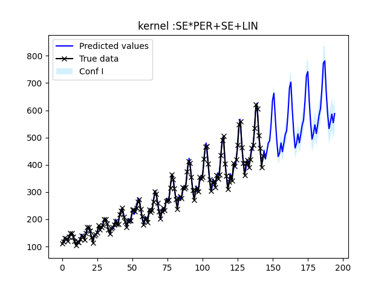
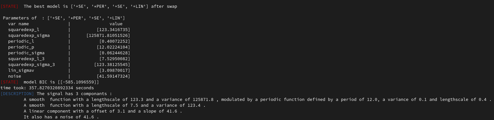
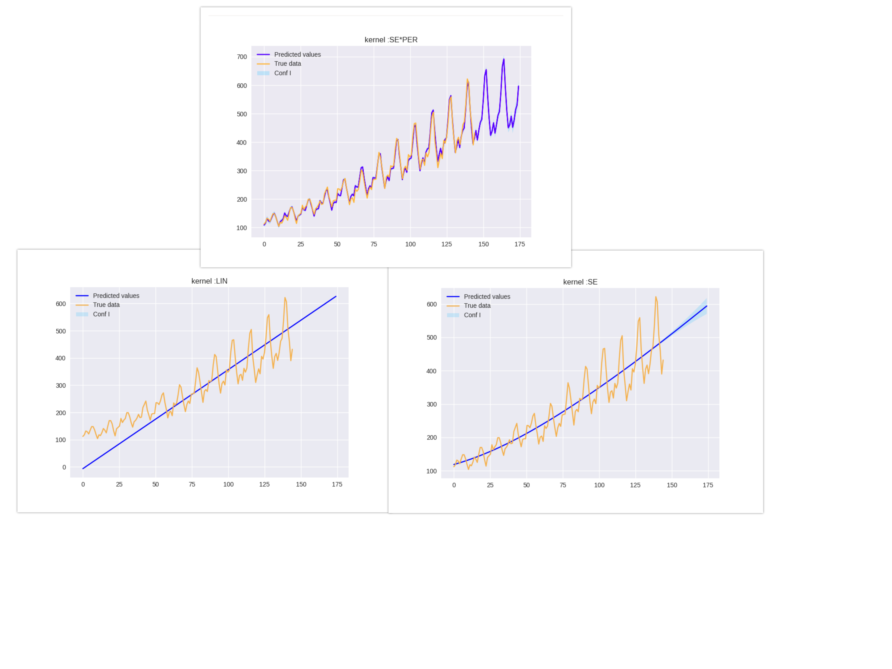

# ABCDflow 

Unofficial implementation of https://arxiv.org/pdf/1302.4922.pdf and https://github.com/duvenaud/phd-thesis

This project uses three differents tehniques to maximize the log likelihood :
- Gradient descent using tensorflow 
- L-BFGS-B optimizer (scipy)
- Wrapper of GPy library

How to use it ?
==============

Install dependence libraries 

```
    pip install -r abcdflow/requirements.txt
```

```python
import numpy as np
import pandas as pd 
from training import *
import matplotlib.pyplot as plt 

if __name__ =="__main__" :
    #load data
    Y = np.array(pd.read_csv("./data/periodic.csv")["x"]).reshape(-1, 1)
    X = np.linspace(0,len(Y),len(Y)).reshape(-1,1)
    # points to predict
    X_s = np.linspace(0,len(Y)+30,len(Y)+30).reshape(-1, 1)
    
    #launch search of best kernels using scipy optimizer and multithreading with 10 random restart for each optimization step
    model,kernel= launch_analysis(X,Y,X_s,straigth=True,do_plot=False,depth=4,verbose=True,initialisation_restart=10,\
                    reduce_data=False,experimental_multiprocessing=True,base_kernels=["+PER","+LIN","+SE"])  #straight 
    
    #Textual description
    model.describe(kernel)
    
    #predict posterior mean and covariance
    mu,cov = model.predict(X,Y,X_s,kernel)
    
    # Plot results 
    model.plot(mu,cov,X,Y,X_s,kernel)
    plt.show()
    
    #Plot contribution of every group of kernel using kernels devellopement as in the article 
    model.decompose(kernel,X,Y,X_s)
    plt.show()
```


Results ?
=======
Prediction
----------


Description
-----------


Decomposition
-------------

