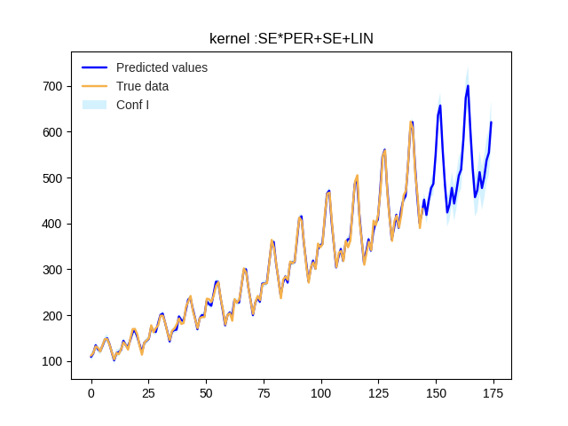
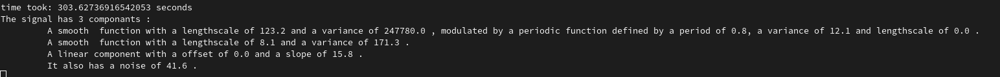
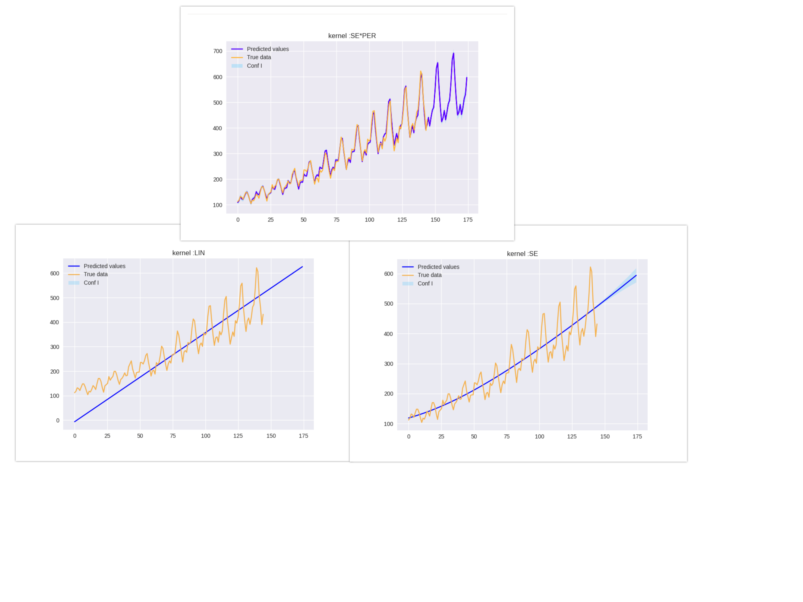

# ABCDflow 

Unofficial implementation of https://arxiv.org/pdf/1302.4922.pdf

This project use three differents tehniques to maximize the log likelihood :
- Gradient descent using tensorflow 
- L-BFGS-B optimizer (scipy)
- Wrapper of GPy library

Prediction
----------

Description
-----------

Decomposition
-------------

